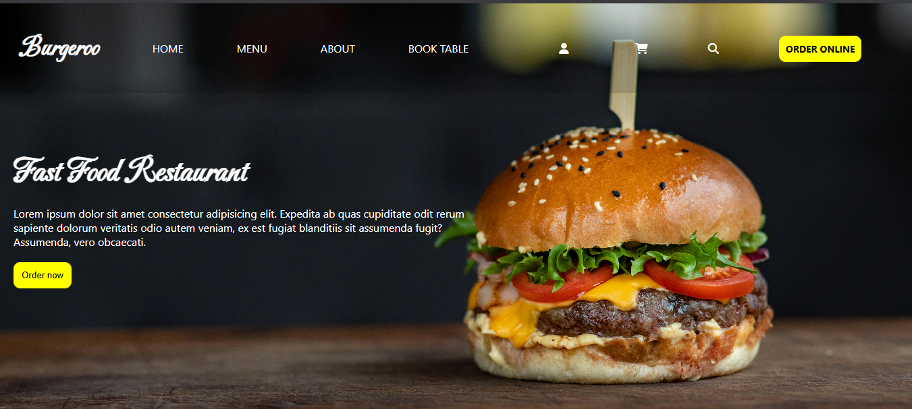
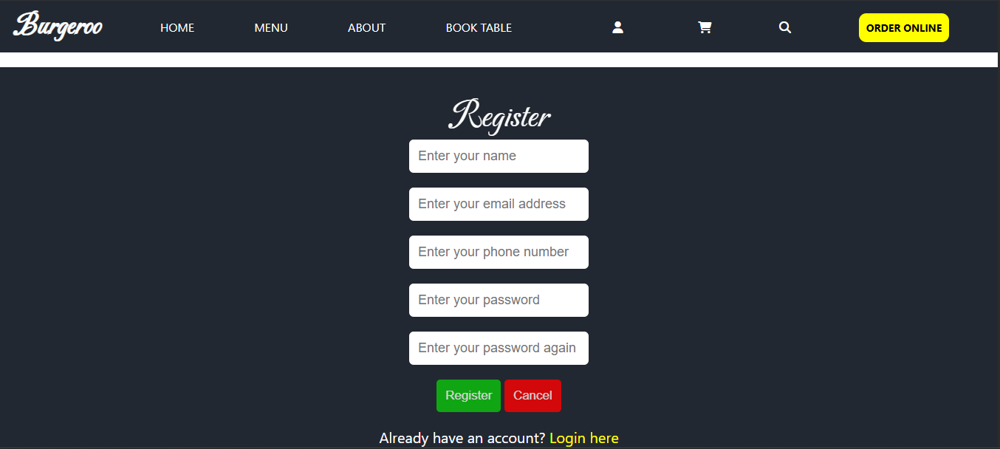
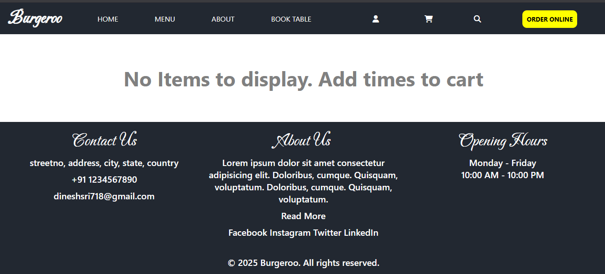

# 🍔 Burgeroo

**Burgeroo** is a sleek and responsive frontend web application designed for a basic food ordering experience. Built using **HTML**, **CSS**, and **JavaScript**, it allows users to register with proper form validation, browse a menu, add items to a cart, and view the total bill. All data is stored in the **browser’s localStorage**, ensuring functionality without a backend.

🔗 **Live Demo**: [https://burgeroo.netlify.app](https://burgeroo.netlify.app)

---

## 📸 Screenshots

> Add these to a `/screenshots` folder if not already done.

| Home Page | Registration Page | Cart Page |
|-----------|-------------------|-----------|
|  |  |  |

---

## 🚀 Features

- ✅ User registration with full form validations
- ✅ Mobile-first responsive design
- ✅ Add/remove items to/from cart
- ✅ View cart and calculate total
- ✅ Cart and user data stored in localStorage
- ✅ Clean and modern UI

---

## 🧰 Tech Stack

- **Frontend**: HTML5, CSS3, Vanilla JavaScript (ES6+)
- **Storage**: Web Browser’s LocalStorage
- **Deployment**: Netlify

---

## 🛠️ How to Run the Project Locally

1. **Clone the repository**
   ```bash
   git clone https://github.com/your-username/burgeroo.git
   cd burgeroo
